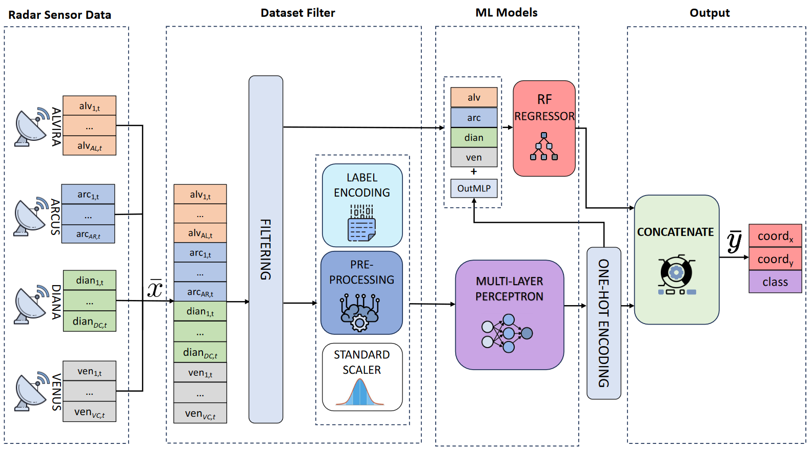

# URANUS

[](https://www.gnu.org/licenses/gpl-3.0) 


This repository contains the source code for the URANUS framework.
URANUS is an ML framework used to identify, classify and track Unmanned Aerial Vehicles (UAV).
For the identification and classification tasks of a UAV, a MLP model is trained and tested, with a final accuracy of 90%. For the tracking task, a single regressor Random Forest model, is deployed to provide the exact position of the UAV, 
with MSE of 0.29, MAE of 0.04, R^2 of 0.93.

<p align="center">
  
</p>

The libraries used by URANUS are the following:

| Plugin                | README                            |
|-----------------------|-----------------------------------|
| PyTorch               | [https://pytorch.org/]            |
| sklearn.preprocessing | [https://scikit-learn.org/stable] |
| NumPy                 | [https://numpy.org/]              |
| Pandas                | [https://pandas.pydata.org/]      |
| Matplotlib            | [https://matplotlib.org/]         |

Screenshot
-----

This is a screenshot of the final application:
<p align="center">
  
</p>

Source organization
------
The project source code has been organized in several folders:
- _app_: this folder contains the final application that uses the trained ML models for real time UAVs tracking, identification and classification;
- _datasets_: in this location the original CSV sensor files are stored, as well as the output of the script for the dataset generation;
- _results_: here there are the pre-trained models described in the paper, as well as the framework schemas and screenshots;
- _scripts_: this folder stores the source codes of ML models and some complementary scripts.

The script folder contains the following source files:
- <a href="scripts/dataset_maker.py">dataset_maker.py</a>: this script merges the original sensor CSV files in order to create the dataset to be used to train ML models;
- <a href="scripts/network_MLP_CLASSIFIER.py">network_MLP_classifier.py</a>: here there is the source of the MLP classifier of the framework;
- <a href="scripts/preprocessing.py">preprocessing.py</a>: the script enriches the content of the merged dataset, for example adding columns of coordinates conversion;
- <a href="scripts/regressor.py">regressor.py</a>: this is the source code of the RF regressor model of the framework, responsible of the tracking task.

Instructions
------
The proposed source files have been developed and tested with Ubuntu 22.04 LTS and Python 3.11 and we encourage to use a similar environment to run the scripts.

Use the following commands to install the scripts' dependencies:

```sh
$ sudo apt-get install python3-pip python3-tk graphviz
$ pip3 install -r requirements.txt
```

License
----

URANUS is released under the GPLv3 <a href="LICENSE">license</a>.
